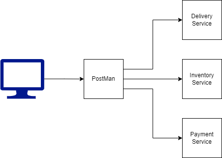

# **Laboratorio N1**
**Curso:** Tópicos Especiales en Telemática  
**Título:** Comunicación entre Procesos Remotos: gRPC. 
**Estudiante** Andrés Echeverri Jaramillo 
### **1. Descripción**
En este laboratorio se desarrollaron 3 microservicios los cuales dos estan hechos en Python: el servicio de pagos (Payment) y el servicio de inventario (Inventory), y uno en Node.js: el servicio de entregas (Delivery), cada una tiene su archivo proto correspondiente para la comunicación con gRPC.

### **2. Estructura**

### **3. Arquitectura**
Se uso un estilo de arquitectura de microservicios, la cual se comunica atravez de gRPC  
### **4. Resultados**
Se logra crear una comunicación de los servicios atravez de postman, permitiendo que cuando se tenga un cliente o un front end puede invocar los metodos de los diferentes servicios. 
### **5. Descripción técnica de la solución implementada**
Para los servicios de python se usaron las librerias: grpcio y grpcio-tools con las cuales con el comando " $ sudo python3 -m grpc_tools.protoc -I ../protobufs --python_out=. --pyi_out=. --grpc_python_out=. ../protobufs/Service.proto" crean las interfaces necesarias para la comunicación gRP, pero antes de esto se debia crear un archivo .proto que maneje los diferentes llamados a los metodos. En Node tambien debe existir el .proto pero en este caso en vez de instalar python y las librerias grpcio y grpcio-tools se instala es Node.js v19.X  
### **6. Guía de uso (En local)**
Para implementar el trabajo primero se tendra que acceder a los archivos de este, por lo tanto se duplicara el repositorio donde estan con el comando "git clone https://github.com/andresecheverrijaramillo/microservicios.git", ya cuando se tengan los archivos clonados se procedera a abrir tres terminales diferentes, una por cada servicio, y se ejecutaran los archivos server.py o server.js dependiendo del servicio, cabe aclarar que se necesitara tener python con las librerias grpcio y grpcio-tools, y Node.js v19.X para que se puedan ejecutar. Si no se tienen instalados se correran los siguientes comandos.  
Python:  
$ sudo apt-get update  
$ sudo apt-get upgrade  
$ sudo apt-get install python3  
$ sudo apt-get install python3-pip  
$ sudo python3 -m pip install grpcio  
$ sudo python3 -m pip install grpcio-tools  
Node:
$ sudo apt-get update  
$ sudo apt-get upgrade  
$ sudo curl -fsSL https://deb.nodesource.com/setup_19.x | sudo -E bash - && sudo apt-get install -y nodejs  
Con esto se asegura que se puedan ejecutar, entonces en el momento que se ejecuten en las diferetes terminales cada una quedara como un servidor, los servidores tienen puertos asociados, el servidor de payment tiene el puerto 8080, el de inventory 8081 y el de Delivery el 8082. teniendo eso encuenta se abre postman para verficar que si funcionen, le decimos que vamos a probar una conección gRPC, en este caso que lo estamos ejecutando los tres server en una misma maquina la coneccion que vamos a probar o en otras palabras el url seria "localhost:####" en el numeral se pondria el puerto del servidor. Para que Postman sepa cuales son los metodos se importara el .proto respectivo como la API y ya se podran hacer las invocaciones de los diferentes metodos que tenga el .proto, en dicho caso de que no se entreguen los parametros que se necesiten o se entreguen mal, la peticion se mandara pero no se hara nada en la terminal del servidor se podra ver mejor esto, en el caso de que se mande se ejecutara sin problema y dara la respuesta que es.